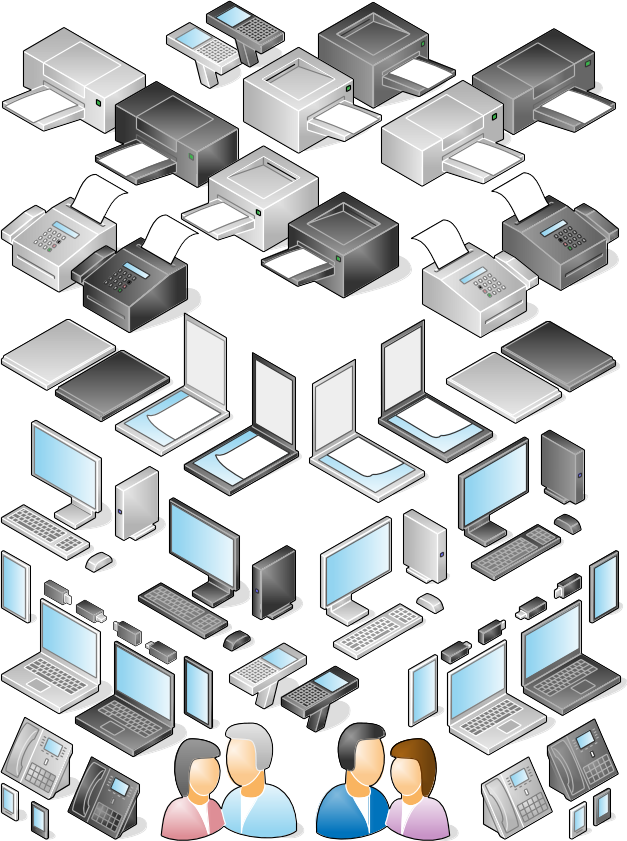
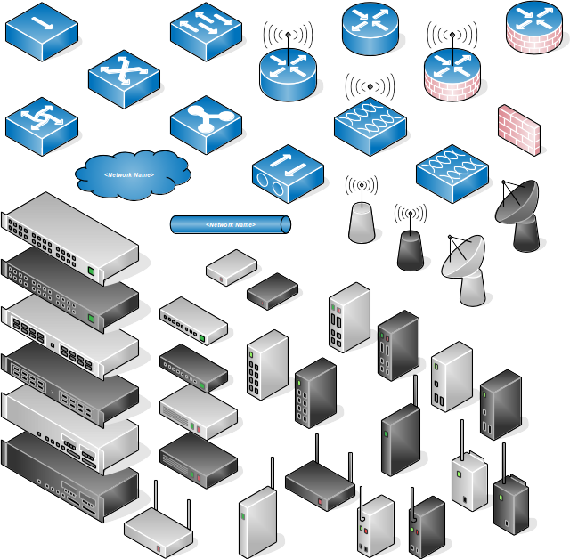
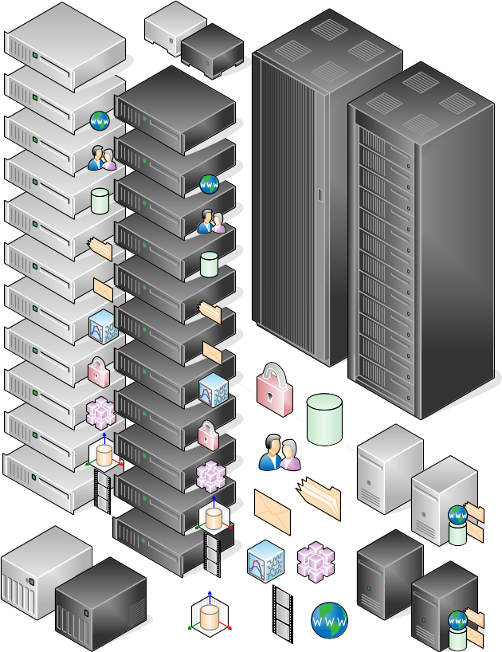
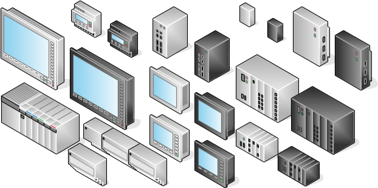
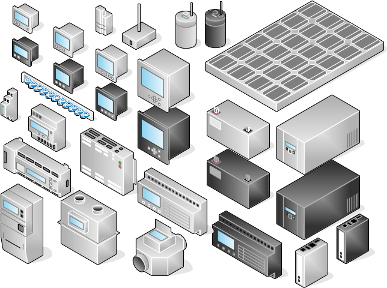
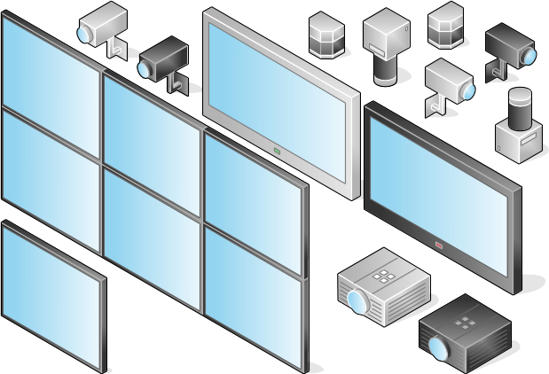

# VRT Network Equipment

## Shape Gallery for LibreOffice/OpenOffice

We're in the business of industrial automation and systems integration, so our need for network equipment is a little different to a traditional IT company. We happen to use LibreOffice for drawing system network diagrams and since we couldn't find a decent collection of consistently-styled equipment shapes that suited our needs, we created our own.

These are designed to allow the creation of network diagrams in a similar style to those produced by Microsoft Visio®. Over 180 shapes in dark and light variants, all drawn in native vector form in a way that allows them to be scaled to any size, and have the line thickness altered without breaking their appearance.

## Gallery Samples

### Clients & Peripherals (58 Shapes)

Desktop PCs, laptops, thin clients, tablets, telephones, printers and other common peripherals - facing left and right, in light and dark.

### Networking & Communications (50 shapes)

As well as the switches, routers, firewalls, WiFi access points and other gear you'd normally find in the data centre, we work with industrial-grade communications equipment (usually DIN-rail mount) extending to fibre, Ethernet and serial devices, as well as cellular modems and routers. There's also a collection of logical shapes to map out your network in the layers above the physical equipment.

### Servers (42 shapes)

A variety of racks, servers and appliances, with a library of common "role" emblems to decorate servers - authentication, database, directory, file, mail, real-time (SCADA), virtualisation, video, visualisation, web. For industrial PC shapes, check out the Industrial Automation Gallery.

### Industrial Automation (21 shapes)

We do a lot of work with SCADA and industrial automation systems, and so our shapes include DCS, PLC and RTUs, as well as data loggers and HMI panels.

### Energy Management (28 shapes)

Energy Management Systems (EMS) shapes including a range of energy meters in single-phase and three-phase variants, DIN and panel mounting, as well as water, gas and thermal meters. We also work with multi-circuit meters in data centres and multi-residential complexes, and utility metering systems for energy billing, as well as co-generation, tri-generation and solar PV systems. Some shapes for specific models of CET energy meters and power quality analysers, as well as our WAGES Hub units (now distributed by CETA) are also included.

### Advanced Visualisation (14 shapes)

Our Visual Workplace solutions blend real-time data capture from automation and energy management systems with 3D real-time graphics rendering technologies. We sometimes combine video feeds with environmental scanning via laser imagers. Output can be anything from large format television displays in building foyers (visitor engagement) to dedicated multi-channel immersive display systems in the mining industry. This gallery reflects the diverse range of vision capture and display systems.

## Tips for Use

1. **Maintain aspect:** When your'e resizing shapes, always hold down the [Shift] key to keep shapes to the same aspect ratio, and maintain the 30° isometric angles.

2. **Set your line width:** Scaling vector objects in LibO/OO doesn't automatically adjust the line width, so if you shrink these shapes in size the lines will likely be too thick, and if scaling up, too thin. You don't need to set the line width after each insert, just place all your objects, size them so they all look right relative to each other, then select all shapes together and adjust the line width until they look right.

3. **Use Glue Points:** LibreOffice and OpenOffice draw have smart connectors like Visio, and by default they snap to the four edges of a shape. The defaults often don't work that well for isometric shapes, and so it's worth getting to know how to use [Glue Points](https://help.libreoffice.org/Impress/Using_Gluepoints).

4. **Use Guides:** You can get away with a rectangular layout and use either straight or curved connectors for reasonable effects, but if you really want to make an impression, consider laying out the entire drawing on an isometric plane. The extension bundles a couple of templates with isometric guidelines to help you do this. Unfortunately LibreOffice and OpenOffice don't yet support smart connectors that snap on 30 degree angles, but there's hope in this [feature request](https://bugs.freedesktop.org/show_bug.cgi?id=80958) (any help getting this prioritised or implemented would be appreciated).

5. **Plan your layout:** You can always start in one corner and then resize everything each time you realise you won't have room to fit it all, or start with paper and pencil as recommended in [this great guide to network diagramming](http://networkdiagram101.com/) by Nathan Booth.

6. **Hack the Shapes:** They all follow a pretty basic recipe, and its easy to pull them apart and recombine them. Even without editing the shape internals, you can quickly get alternate effects to show (for example) future or planned infrastructure. The sample below shows a server with a couple of variations available just by setting line style and fill colour. 

## License

The shapes are offered under a [Creative Commons Attribute-ShareAlike V3 license](license/cc-by-sa-3.0.txt) which allows commercial and non-commercial use, modification and redistribution as long as the terms of the license are met.

**An exemption from the attribution clause is given for "intended use"**, which is defined as the use of these shapes to create network diagrams representing existing or planned networks, wherein the resulting diagrams may then be distributed without attribution. In other words, you don't need to mark all your diagrams with a link to the VRT Systems website just because it has some of our shapes in it (though that would be nice :), **but we do require the license terms be honoured (with attribution) when redistributing the collection** (as a whole or in part, either as a LibreOffice/OpenOffice extension, or repackaged in other formats).
